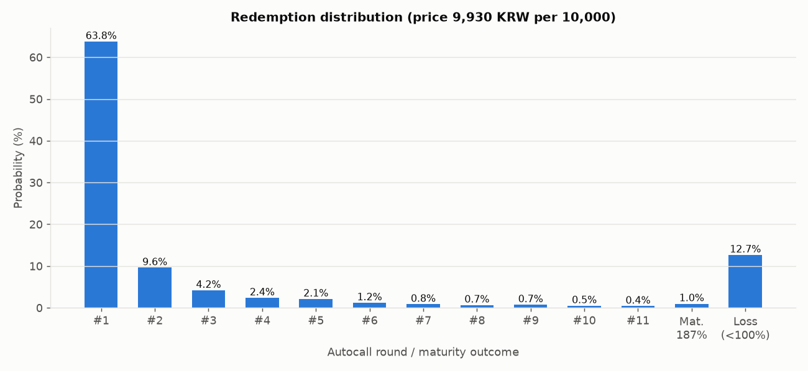
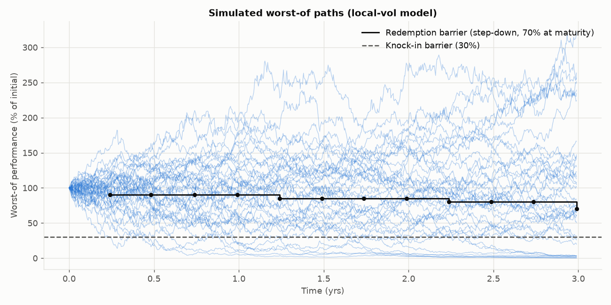
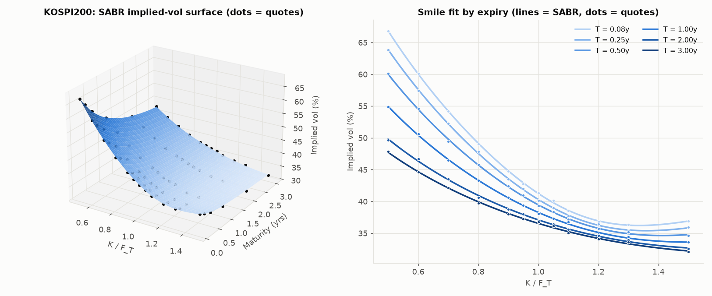
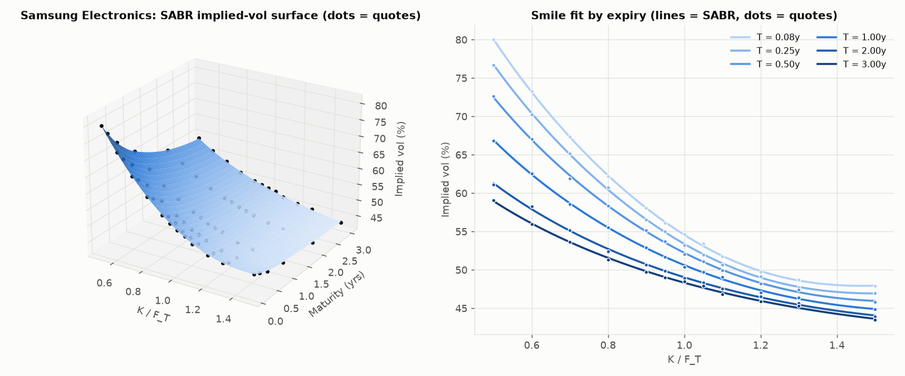
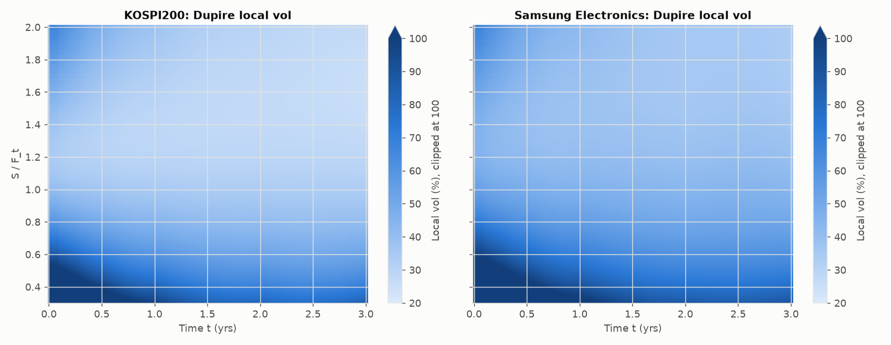

# ELS Pricing: SABR → Dupire → 2자산 Cholesky 몬테카를로

미래에셋증권 제38078회 파생결합증권(ELS) 투자설명서의 상품(KOSPI200 / 삼성전자 보통주, 스텝다운 **Worst-of**, KI 30%)을 다음 파이프라인으로 평가한다.

```
 내재변동성 호가 ──► SABR 슬라이스 보정 ──► 변동성 곡면 σ(K,T) ──► Dupire 국소변동성 σ_loc(S,t)
 (자산별)           sabr.py                vol_surface.py          dupire.py
                                                                         │
 상관계수 ρ ──► Cholesky ──► 상관 브라운운동 ──► 로그-오일러 경로 생성 ◄──┘
                              simulation.py
                                    │
        상품 조건(product.py) ──► 조기상환 / 낙인 / 만기 페이오프 ──► 할인 평균 = 이론가 (pricer.py)
```

## 실행

```bash
pip install -r requirements.txt          # numpy, scipy, matplotlib
python ELS_pricing/run_demo.py           # 약 20초 (10만 경로). 옵션: --paths --seed --beta --correction obloj --no-plots
pip install pytest && pytest ELS_pricing/tests -q   # 15개 검증 테스트
```

## 폴더 구성

| 파일 | 역할 | 핵심 클래스 / 함수 |
|---|---|---|
| `product.py` | 상품 조건, 영업일 격자, 페이오프 규칙 | `ELSTerms`, `ELSSchedule`, `build_schedule`, `autocall_redeems`, `maturity_payout`, `mirae_38078_terms` |
| `market_data.py` | 호가 입력 형식, 합성 호가 생성, 시장 가정 | `MarketQuotes`, `AssetSpec`, `make_synthetic_quotes`, `mirae_38078_market` |
| `sabr.py` | Hagan / Oblój 내재변동성 공식, 슬라이스 캘리브레이션 | `sabr_implied_vol`, `calibrate_sabr_slice`, `SABRParams` |
| `vol_surface.py` | 만기별 보정 → 파라미터 보간 → 곡면 | `SABRVolSurface` |
| `black.py` | 블랙 콜 가격 (Dupire 검증용) | `black_call` |
| `dupire.py` | Dupire 국소변동성 (내재분산 방식 + 가격식 검증 방식) | `DupireLocalVol`, `local_vol_from_prices`, `FlatLocalVol` |
| `simulation.py` | Cholesky 상관 + 로그-오일러 + 대조변수 | `CorrelatedLocalVolSimulator`, `cholesky_factor` |
| `pricer.py` | 경로 위 페이오프 평가, 통계, 표준오차 | `ELSPricer`, `PricingResult` |
| `plotting.py` | 변동성 곡면 / 국소변동성 / 경로 / 상환 분포 그림 | `plot_*` |
| `run_demo.py` | 전체 파이프라인 실행 스크립트 | `main` |
| `tests/` | 정답을 아는 상황으로 구현을 검증하는 pytest | |

모든 `.py` 파일은 맨 위 docstring에 *목적 · 수식 · 가정 · 참고문헌*을 적었고, 코드 각 줄에 한국어 주석을 달았다.

## 1. 상품 구조 (투자설명서 p.142–148)

| 항목 | 내용 |
|---|---|
| 기초자산 | KOSPI200 지수, 삼성전자 보통주 (Worst-of) |
| 발행일 / 만기평가일 / 만기일 | 2026-09-10 / 2029-09-05 / 2029-09-10 |
| 자동조기상환 | 3개월마다 11회. **모든** 기초자산이 배리어 이상이면 액면 × (1 + 7.25% × 차수) 지급 (평가일 + 3영업일) |
| 조기상환 배리어 | 1–4차 90%, 5–8차 85%, 9–11차 80% (스텝다운) |
| 만기 (조기상환 없을 때) | 모든 자산 ≥ 70% → **187%**. 아니어도 KI(30% 미만 하락) 한 번도 없으면 **187%**. KI 발생 + 70% 미만이면 **액면 × 만기 worst 성과** |
| KI | 최초기준가격평가일 익일~최종관찰일, 종가 기준 일별 관찰 |

KI가 일별 종가 관찰이므로 **영업일 단위로 시뮬레이션하면 이산 관찰이 그대로 재현**된다 (연속관찰용 Brownian bridge 보정 불필요).

## 2. 모형

**자산별 국소변동성 + 상관 브라운운동**

$$\frac{dS_i}{S_i} = \mu_i\,dt + \sigma_i^{loc}(S_i,t)\,dW_i,\qquad d\langle W_1,W_2\rangle=\rho\,dt$$

- 드리프트 $\mu_i = r - q_i$ 는 요청대로 **외부에서 주어진 값**이다 (`AssetSpec.drift`). 할인율 $r$ 은 별도 입력이다.
- 상관 $\rho$ = 0.9558 (설명서 p.144, 180영업일 일별수익률). Cholesky $R = LL^\top$ 로 $W = LZ$ 를 만든다.
- 이산화: 로그-오일러 $\ln S_{k+1} = \ln S_k + (\mu - \tfrac12\sigma^2)\Delta t + \sigma\sqrt{\Delta t}\,(LZ)$, 스텝 = 영업일.

**SABR (자산별, 만기별)**

$$dF = \alpha F^{\beta}dW_1,\quad d\alpha = \nu\alpha\,dW_2,\quad d\langle W_1,W_2\rangle=\rho\,dt$$

β는 보정하지 않고 고정한다 (기본 β = 1, 주식의 관행). 각 만기에서 $(\alpha,\rho,\nu)$ 를 Hagan 공식에 최소제곱으로 맞추고, 만기 사이는 $(\alpha,\rho,\nu)$ 를 PCHIP 보간한 뒤 그 만기로 공식을 다시 평가한다.

**Dupire 국소변동성 ("forward vol")**

$y=\ln(K/F_T)$, $w(y,T)=\sigma_{imp}^2T$ 일 때 (Gatheral 2006, eq. 1.10)

$$\sigma_{loc}^2=\frac{\partial_T w}{1-\frac{y}{w}\partial_y w+\frac14\left(-\frac14-\frac1w+\frac{y^2}{w^2}\right)(\partial_y w)^2+\frac12\partial_{yy}w}$$

분모는 확률밀도에 비례하므로 ≤ 0 이면 버터플라이 차익거래다. 이 값은 "시점 t에 S가 K일 때의 **순간** 선도변동성"이며, 두 만기 사이의 선도 *내재*변동성과는 다른 개념이다. 구현은 두 가지다.

- `local_variance_from_implied` (기본): 위 식을 SABR 곡면의 유한차분으로 계산 — 가격을 두 번 미분하는 것보다 안정적.
- `local_vol_from_prices` (검증용): Dupire 원식 $\sigma^2 = (C_T + \mu K C_K + qC)/(\tfrac12K^2C_{KK})$ 를 블랙 가격의 유한차분으로 계산. 두 구현은 테스트에서 1% 이내로 일치한다.

## 3. 참고문헌 (SABR 구현의 근거 포함)

**SABR**

| # | 문헌 | 이 코드에서의 사용처 |
|---|---|---|
| 1 | Hagan, Kumar, Lesniewski, Woodward (2002), *Managing Smile Risk*, Wilmott Magazine, Sep 2002, 84–108 | SABR 모형 정의, 내재변동성 근사식 (2.17a–c), ATM 극한 (2.18) → `sabr._sabr_vol_hagan` |
| 2 | Oblój (2008), *Fine-tune your smile: Correction to Hagan et al.*, Wilmott Magazine (arXiv:0708.0998) | β < 1 에서의 z 수정식 → `sabr._sabr_vol_obloj` (`--correction obloj`) |
| 3 | West (2005), *Calibration of the SABR Model in Illiquid Markets*, Applied Mathematical Finance 12(4), 371–385 | β 사전 고정, 다중 초기값 최소제곱 → `calibrate_sabr_slice` |
| 4 | Hagan, Kumar, Lesniewski, Woodward (2014), *Arbitrage Free SABR*, Wilmott Magazine, Jan 2014 | 근사식의 음의 밀도 한계 인식 → `dupire.diagnostics()` 와 클리핑 |
| 5 | Gatheral (2006), *The Volatility Surface: A Practitioner's Guide*, Wiley (교과서) | 총분산 표현, 무차익 조건, Dupire의 내재분산 형태 (eq. 1.10) |
| 6 | Rebonato, McKay, White (2009), *The SABR/LIBOR Market Model*, Wiley (교과서) | SABR 파라미터 해석, β 선택 |

**Dupire / 국소변동성**

| # | 문헌 | 사용처 |
|---|---|---|
| 7 | Dupire (1994), *Pricing with a Smile*, Risk 7(1), 18–20 | 국소변동성 정의 |
| 8 | Derman, Kani (1994), *Riding on a Smile*, Risk 7(2), 32–39 | 같은 아이디어의 이항트리 버전 (배경) |
| 9 | Andersen, Brotherton-Ratcliffe (1997/98), *The equity option volatility smile: an implicit finite difference approach*, J. Computational Finance 1(2), 5–37 | 국소변동성의 수치 안정성 (배경) |
| 10 | Breeden, Litzenberger (1978), *Prices of state-contingent claims implicit in option prices*, J. Business 51(4), 621–651 | $C_{KK}$ = 확률밀도 → 분모 g의 의미 |
| 11 | Fritsch, Carlson (1980), *Monotone piecewise cubic interpolation*, SIAM J. Numer. Anal. 17(2), 238–246 | 파라미터 PCHIP 보간 |

**몬테카를로 / 상품**

| # | 문헌 | 사용처 |
|---|---|---|
| 12 | Glasserman (2004), *Monte Carlo Methods in Financial Engineering*, Springer (교과서) | Cholesky 상관 난수(§2.3), 로그-오일러(Ch.3), 대조변수(§4.2) |
| 13 | Shreve (2004), *Stochastic Calculus for Finance II*, Springer (교과서) | 상관 브라운운동의 Cholesky 표현 |
| 14 | Black (1976), *The pricing of commodity contracts*, J. Financial Economics 3, 167–179 | `black.py` |
| 15 | Hull, *Options, Futures, and Other Derivatives* (교과서) | 옵션/MC 일반 배경 |
| 16 | Jiang, Tian (2005), *The Model-Free Implied Volatility and Its Information Content*, Review of Financial Studies 18(4), 1305–1342 | 투자설명서가 변동성 기간구조를 구한 방법 (본 코드는 SABR로 대체) |

> 위 서지 정보(권호·쪽수)는 작성 시점의 기억에 기반한 것이므로, 논문에 직접 인용하기 전에 원문으로 한 번 더 확인할 것.

## 4. 데모 결과 (`python ELS_pricing/run_demo.py`, 10만 경로, seed 1)

| 모형 | 이론가 (원 / 액면 10,000) | 표준오차 | 조기상환 확률 | 손실 확률 | 평균 수명 |
|---|---|---|---|---|---|
| 상수 변동성 (설명서 36.29% / 47.99%, ρ=0.9558) | **10,578** | 10.0 | 85.2% | 10.1% | 0.83년 |
| **SABR + Dupire 국소변동성** | **9,930** | 10.8 | 86.4% | 12.7% | 0.77년 |
| 설명서 이론가 (2026-08-25, 헤지비용 제외) | 10,551.48 | | | | |

- 설명서와 같은 전제(상수 변동성 + 상관)에서 이론가가 설명서 값과 **0.3%** 차이로 맞는다. 이자율 3%, 배당수익률 1.5%/2.0%는 설명서에 없어 제가 둔 가정치인데도 이 정도로 맞으므로 시뮬레이션과 페이오프 로직이 대체로 타당하다는 간접 근거다.
- SABR + Dupire 가격이 더 낮은 이유는 **하방 스큐**다. 하락 구간의 국소변동성이 높아 KI(30%) 터치 확률이 올라가고(KI 터치 후 만기 생존 10.3% → 13.1%), 손실이 났을 때의 평균 상환금도 27.7% → 15.4% 로 나빠진다.







## 5. 검증 (`tests/test_els_pricing.py`, 15개)

- SABR: ATM 극한식 일치/연속, β = 1 에서 Hagan = Oblój, 노이즈 없는 스마일에서 (α, ρ, ν) 복원
- Dupire: 평평한 곡면 → 평평한 국소변동성, 내재분산 방식 vs 가격 유한차분 방식 1% 일치
- **국소변동성 MC가 SABR 곡면의 바닐라 콜 가격을 재현** (스팟의 15bp 이내) — Dupire 격자와 시뮬레이터가 함께 맞는지 보는 가장 강한 검사. 실측 편차는 0.3~9bp이며 전 구간에 걸친 약간의 양(+)의 편향은 오일러 이산화와 보간 때문이다 (ATM 변동성 약 0.1 vol pt 수준).
- 시뮬레이터: Cholesky 분해, 로그수익률 상관/표준편차/평균 재현
- 가격결정기: 변동성 0 인 결정론적 시나리오 (1차 상환 / KI 손실)의 정확한 값, 설명서 조건과 일치하는 스케줄

## 6. 가정과 한계 — 결과 해석 전에 반드시 읽을 것

1. **변동성 호가는 합성 데이터다.** 실제 KOSPI200 / 삼성전자 옵션 호가가 없어, 설명서의 ATM 변동성에 수준을 맞춘 가상의 SABR 스마일 (ρ = −0.55, ν 1.2→0.5, 노이즈 20bp)을 `make_synthetic_quotes`로 만들었다. 따라서 **SABR+Dupire의 절대 가격(9,930원)은 가정한 스큐의 산물**이며 실제 시장 가격이 아니다. 아래 §7처럼 실제 호가로 교체해야 의미 있는 값이 된다.
2. **KI 구간(S/S0 ≈ 30%)은 호가 범위 밖의 외삽이다.** 호가는 K/F ≥ 0.5 까지만 있고 KI는 0.3 이다. SABR 외삽 + Dupire는 저주가 영역에서 국소변동성을 크게 키우고 (S/F = 0.4 에서 약 70–140%), 일부 경로가 0 근처로 붕괴한다 (경로 그림 참고). 가격은 이 영역에 민감하므로 `DupireLocalVol(max_vol=...)` 상한과 호가 범위를 바꿔 민감도를 반드시 확인할 것.
3. **Hagan 근사식은 차익거래를 막지 못한다.** 달력 스프레드/음의 밀도를 `calendar_arbitrage_fraction`, `diagnostics()`로 진단하고, g ≤ 0 이거나 변동성이 범위 밖인 노드는 [5%, 200%]로 클리핑한다 (데모에서는 달력 차익 0%, 음의 밀도 0%, 상한 클리핑 0.1–0.3% 노드). 필요하면 Hagan 2014 (arbitrage-free SABR)나 SVI 같은 무차익 곡면으로 교체할 수 있다 (`SABRVolSurface`의 `implied_vol` 인터페이스만 맞추면 된다).
4. **이자율 3%, 배당수익률(드리프트) 1.5% / 2.0% 는 자리표시자.** 설명서에 없는 값이며, 요청대로 drift는 외부 입력이다. 할인율은 단일 연속복리 이자율이고 발행사 신용스프레드(AA)는 반영하지 않는다.
5. **시간축**: 연 단위 시간 = 달력일 / 365 (ACT/365), 일별 스텝의 분산은 달력 시간에 비례한다 (주말 스텝은 3일치). 한국 공휴일은 기본값에 없으므로 `mirae_38078_terms(holidays=("YYYY-MM-DD", ...))` 로 넣으면 격자와 지급일에 반영된다 (조기상환일이 휴장일이 되면 오류를 낸다).
6. **국소변동성은 SLV가 아니다.** 스큐는 잘 맞추지만 선도 스큐 / 변동성의 변동성 동역학은 반영하지 못하므로 Worst-of 상품의 상관·스큐 민감도가 과소/과대평가될 수 있다. 상관 ρ 는 상수다.
7. 헤지비용, 세금, 중도환매 가격은 모델에 없다 (설명서의 이론가도 헤지비용을 제외한다).

## 7. 실제 시장 데이터로 교체하는 방법

```python
import numpy as np
from ELS_pricing import MarketQuotes, SABRVolSurface

quotes = MarketQuotes(
    name="KOSPI200", spot=1088.61, drift=0.015,           # drift = r - q (주어진 값)
    expiries=np.array([...]),                             # 만기(연), 오름차순
    fwd_moneyness=np.array([...]),                        # K / F_T, 오름차순
    vols=np.array([[...], ...]),                          # shape (만기 수, 머니니스 수) 내재변동성
)
surface = SABRVolSurface.calibrate(quotes, beta=1.0)      # 이후 DupireLocalVol(surface, t_max) 부터는 동일
```

호가가 만기마다 다른 절대 행사가로 주어진다면 `calibrate_sabr_slice(F, T, strikes, vols)`로 만기별 보정을 직접 하고 `SABRVolSurface(name, spot, drift, beta, correction, slices)`에 슬라이스 목록을 넘기면 된다.

## 8. 확장 아이디어

- 확률-국소변동성(SLV) 또는 Heston 기반 모형으로 선도 스큐 동역학 반영
- 중도환매/발행사 신용스프레드(할인 곡선), 실제 공휴일 캘린더
- 그릭스(델타·베가·상관 민감도): 공통난수 + 유한차분 (`extendible_pricing/greeks.py`의 방식 참고)
- 경로 수 증가 시 병렬화 / 준난수(Sobol) 도입
